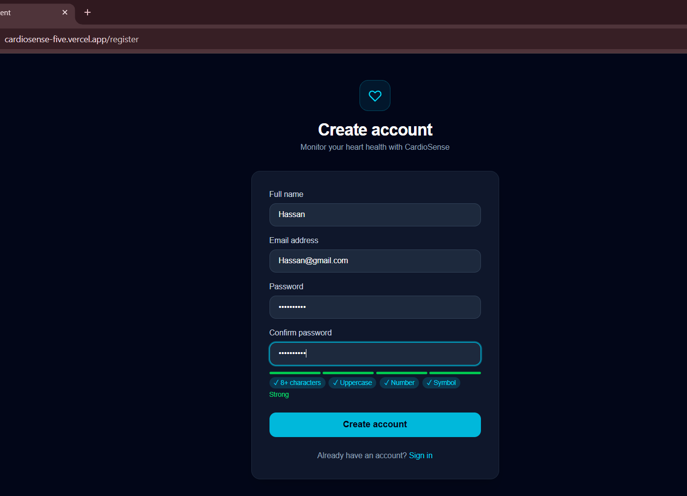
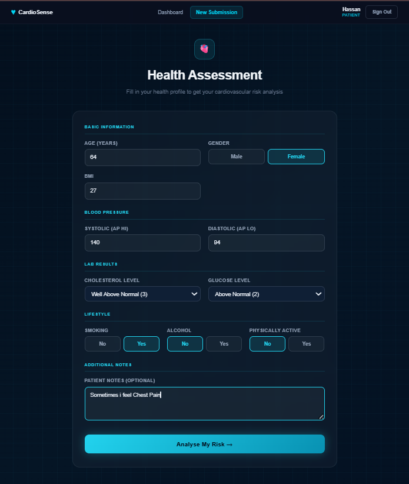
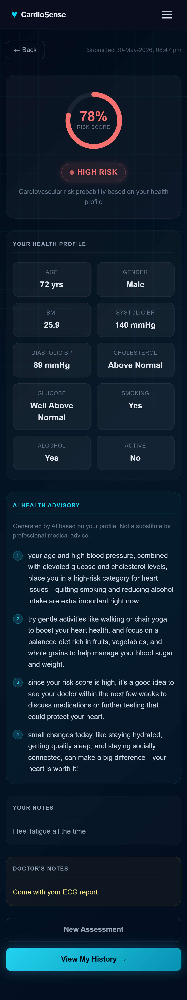
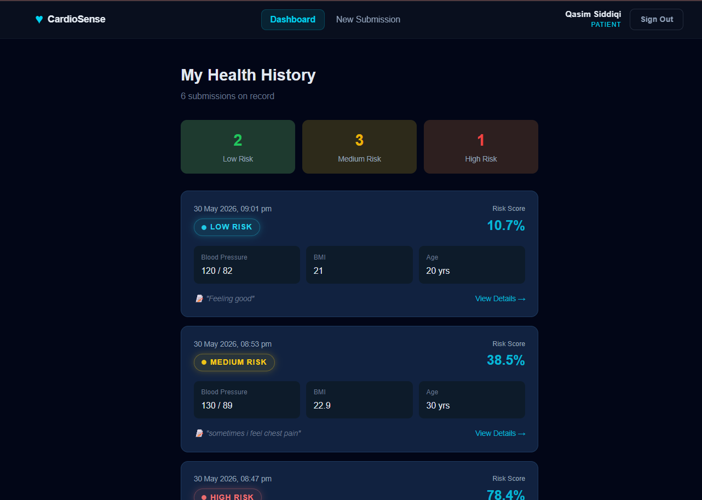
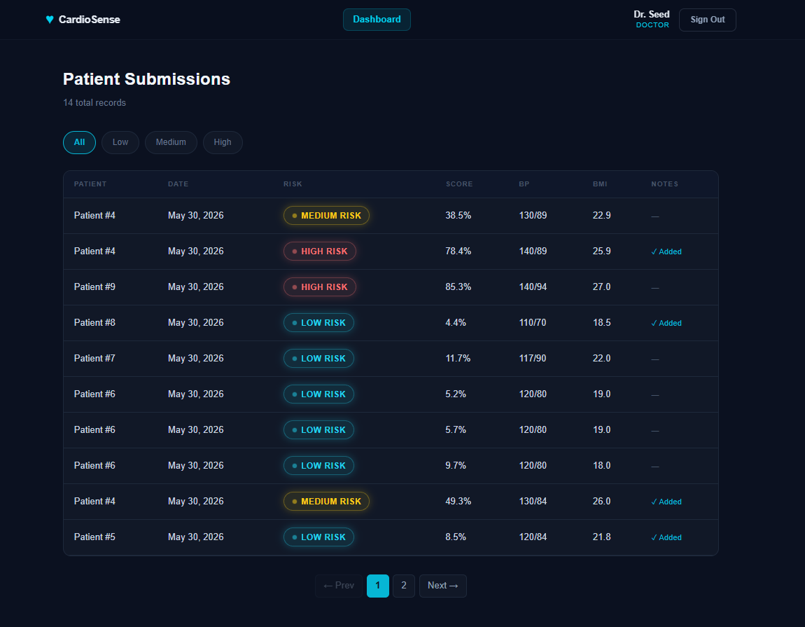
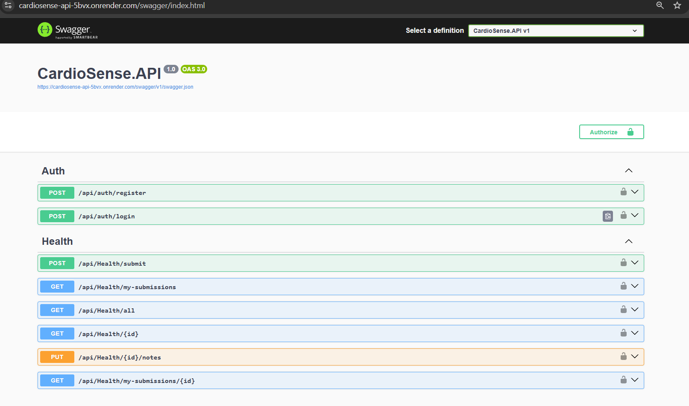

# CardioSense

A full-stack health application where patients submit their health profile and receive a cardiovascular risk prediction from a trained ML model, along with a personalized advisory generated by an LLM. Doctors can view all submissions, filter by risk level, and add clinical notes — which sends an email notification to the patient.

**Live:** [cardiosense-five.vercel.app](https://cardiosense-five.vercel.app/login) 
· **API:** [cardiosense-api-5bvx.onrender.com/swagger](https://cardiosense-api-5bvx.onrender.com/swagger) 
· **ML Service:** [qasim7864-cardiosense-ml.hf.space](https://qasim7864-cardiosense-ml.hf.space/docs)

> The free Render instance spins down after inactivity — first request may take 30–60 seconds.

## Screenshots

| Page | Preview |
|---|---|
| Register |  |
| Health Form |  |
| Risk Result + LLM Advisory |  |
| Patient Dashboard |  |
| Doctor Dashboard |  |
| Swagger UI |  |

## Tech Stack

| Layer | Technology |
|---|---|
| Frontend | React 19 (Vite), Tailwind CSS v4, Axios, React Router v7 |
| Backend | ASP.NET Core 10 Web API, C# |
| Database | PostgreSQL via Neon — EF Core Code-First + Npgsql |
| ML Service | Python FastAPI + scikit-learn (`.pkl` pipeline) |
| Auth | JWT Bearer Tokens, BCrypt |
| LLM | OpenRouter API (`mistralai/mistral-7b-instruct`) |
| Deployment | Vercel · Render (Dockerized) · Hugging Face Spaces |
| Email | SMTP/Gmail — works locally, blocked by Render on free tier |

## Features

**Patient** — register/login, submit health profile, get risk score (Low/Medium/High) + LLM advisory, add personal notes, view submission history.

**Doctor** (seeded account) — view all patient submissions, filter by risk level, paginate, add/update clinical notes. Patient gets an email notification when notes are added.

## Architecture

```
[React — Vercel]
      │  HTTPS + JWT
      ▼
[ASP.NET Core API — Render]
      ├──► /predict  →  [FastAPI ML Service — Hugging Face Spaces]
      │                     returns { risk_score, risk_level }
      ├──► OpenRouter LLM API
      │                     returns advisory text
      └──► PostgreSQL (Neon) via EF Core
```

## API Endpoints

**Auth (public)**

| Method | URL | Body |
|---|---|---|
| POST | `/api/auth/register` | `RegisterDto` |
| POST | `/api/auth/login` | `LoginDto` |

**Health — Patient role**

| Method | URL |
|---|---|
| POST | `/api/health/submit` |
| GET | `/api/health/my-submissions` |
| GET | `/api/health/my-submissions/{id}` |

**Health — Doctor role**

| Method | URL | Query Params |
|---|---|---|
| GET | `/api/health/all` | `riskLevel`, `page`, `pageSize` |
| GET | `/api/health/{id}` | |
| PUT | `/api/health/{id}/notes` | |

**ML Service**

| Method | URL | Returns |
|---|---|---|
| POST | `/predict` | `{ risk_score, risk_level }` |

## Running Locally

**Prerequisites:** .NET 10 SDK, Node.js 18+, Python 3.10+, PostgreSQL or Neon connection string

```bash
git clone https://github.com/Qasim-Siddiqi/CardioSense.git
cd CardioSense
```

**Backend**
```bash
cd CardioSense/CardioSense.API
# fill in appsettings.json (see appsettings.json Structure below)
dotnet ef database update
dotnet run
# Swagger at http://localhost:5144/swagger
```

**ML Service**
```bash
cd ml_service
pip install -r requirements.txt
uvicorn main:app --reload --port 8000
```

**Frontend**
```bash
cd cardiosense-client
npm install
npm run dev
# http://localhost:5173
```

**appsettings.json**
```json
{
  "ConnectionStrings": {
    "DefaultConnection": "Host=...;Database=CardioSenseDB;Username=...;Password=..."
  },
  "Jwt": {
    "Key": "use-your-secret-key",
    "Issuer": "CardioSenseAPI",
    "Audience": "CardioSenseClient",
    "ExpiryHours": 24
  },
  "PredictionServiceUrl": "http://localhost:8000",
  "LLM": {
    "ApiKey": "your-openrouter-key",
    "BaseUrl": "https://openrouter.ai/api/v1/",
    "Model": "mistralai/mistral-7b-instruct"
  },
  "Email": {
    "Host": "smtp.gmail.com",
    "Port": 587,
    "Username": "your-gmail",
    "Password": "your-app-password",
    "From": "your-gmail"
  }
}
```

A Doctor account is seeded automatically on first startup: `doctor@cardiosense.com` / `Doctor@123`

## Deployment Notes

- **Vercel** — `vercel.json` rewrites all routes to `index.html` for SPA routing
- **Render** — deployed via `Dockerfile`; secrets set as environment variables in dashboard
- **Hugging Face Spaces** — FastAPI app with `final_pipeline.pkl`
- **Database** — migrated from SQL Server (`Microsoft.EntityFrameworkCore.SqlServer`) to PostgreSQL (`Npgsql.EntityFrameworkCore.PostgreSQL`) for cloud deployment
- **Email** — uses fire-and-forget pattern so a failed send never blocks the API response. Render's free tier blocks outbound SMTP, so email is disabled in production.

## Project Structure

```
CardioSense/
├── CardioSense.API/
│   ├── Controllers/       AuthController, HealthController
│   ├── Services/          Auth, Health, Prediction, LLM, Email + interfaces
│   ├── DTOs/              Auth/ and Health/ DTOs
│   ├── Models/            User, HealthSubmission
│   ├── Data/              AppDbContext
│   └── Program.cs         DI, JWT, CORS, middleware, doctor seed
├── cardiosense-client/
│   └── src/
│       ├── api/           axios instance, authApi, healthApi
│       ├── context/       AuthContext
│       ├── components/    Navbar, RiskBadge, SubmissionCard, Pagination
│       └── pages/         Login, Register, HealthForm, Result, Dashboards
├── ml_service/
│   ├── main.py            FastAPI /predict endpoint
│   ├── final_pipeline.pkl trained scikit-learn pipeline
│   └── requirements.txt
└── Dockerfile             multi-stage build for Render
```
